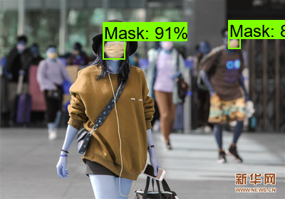

# mask-or-no-mask-detection
A Tensorflow Object Detection API based application using Faster RCNN architecture.

In this time of corona, it is recommended to where mask as precautionary messure. But many people seem to not wear mask.
  This Mask detection application will help us to detect whether or not a person has wore a mask.
This Repository contains code of deployement. 
<a href="https://drive.google.com/drive/folders/1vGN61pqZ1MKpbTL4cVYMCUQMBzsDfA7i?usp=sharing">Trained Model</a>
## Input Screen

## Output Screen

          
## How I created this project and deployed it

<ol>
  <li>I downloaded this mask images from kaggle <a href="https://www.kaggle.com/andrewmvd/face-mask-detection"> dataset</a></li>
  <li>Then I annoted those images using <a href="https://github.com/tzutalin/labelImg">LabelImg</a>. For creating xml file of Pascal Voc compatible.
  <li>Once, annotations were done I first converted xml files to csv and then converted that csv file into record file.</li>
  <li>I used <a href="https://github.com/tensorflow/models/tree/master/research/object_detection">Tensorflow Object Detection API</a> TF version =1</li>
  <li>I used Faster RCNN architecture for this task, so I downloaded it's pre-trained model and customize it's config file as per my requirements.</li>
  <li>Then I trained my model. After training I created it's inference graph and used that inference graph to detect whether or not person wearing a mask</li>
  <li>Code for running inference was taken from <a href="https://github.com/EdjeElectronics/TensorFlow-Object-Detection-API-Tutorial-Train-Multiple-Objects-Windows-10/blob/master/Object_detection_image.py">here</a> then I modified it as per my need.
  </li>
</ol>

## How does deployed model work

<ol>
<li>It takes png image as input from user</li>
<li>Then that image is passed for inferencing and detection takes places. Once the image is classified and detected into either of any class this app returns a downloadable attachment which contains our ouput image</li>
</ol>
